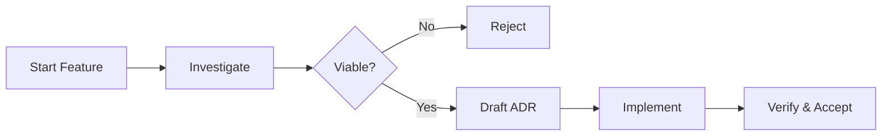

# 🤖 AI-Native Development Template

[](LICENSE)
[](https://github.com/features/copilot)

> **A standardized, agentic workflow for modern software engineering.**
> This template configures GitHub Copilot CLI with specialized agents, skills, and prompt commands to streamline the entire software development lifecycle—from architectural decision-making to high-performance coding.

---

## 🚀 The "Feature-First" Workflow

We enforce a rigorous yet efficient development loop that prioritizes **thinking before coding**.



### 1. Exploration 🧭
Start by creating a dedicated feature space. This encourages isolated experimentation. Often I find it helpful and beneficial to do multiple investigations and designs before formalizing a plan. The low level details will stay in the investigation documents while the higher level functional requirements and architectural elements will be formalized in the ADR.
- **`create feature {name}`**: Scaffolds a new feature folder with a readiness checklist.
- **`investigate {topic} for {feature}`**: Creates a structured document to explore specific technical approaches.

### 2. Decision Making ⚖️
Once investigations yield a clear path, formalize it using Architecture Decision Records (ADRs).
- **`create ADR for {feature}`**: Synthesizes successful investigations into a **Proposed** ADR.
- **`reject investigation {topic} for {feature}`**: Formally rejects an investigation path with rationale (crucial for future context).

### 3. Implementation & Iteration 🛠️
This is where the actual coding happens.
- **`implement {task}`**: The primary engine for implementation. Delegates to appropriate coding agents based on complexity.
- **Delegate**: Use the specialized agents (see below) through the task command to implement the ADR requirements.

### 4. Finalization ✅
- **`review PR`** or **`code review`**: Technical PR review focused on logic, bugs, and style. It filters false positives and auto-fixes critical items.
- **`wa review`** or **`architecture review`**: High-level architectural audit based on the Well-Architected Framework.
- **`update documentation`**: Triggers the documentation agent to update project documentation.
- **`accept ADR for {feature}`**: Moves the implemented ADR to the permanent record and marks the feature as complete.

---

## 🧠 Specialized Agents

Your team of expert sub-agents, each optimized for specific lifecycle phases. Located in `.github/agents/`.

| Agent | Role | Best For |
|-------|------|----------|
| **`adr-analyzer`** | 📐 **Architect** | Parsing ADRs, creating task lists, and verifying implementation compliance. |
| **`coding-agent`** | 🔨 **Engineer** | Standard feature implementation, refactoring, and multi-file changes. |
| **`complex-coding-agent`** | 🧠 **Sr. Engineer** | High-complexity architecture, race conditions, and system design. |
| **`fast-coding-agent`** | ⚡ **Junior Dev** | Single-file edits, quick fixes, test fixes, and build errors. |
| **`well-architected-agent`** | 🛡️ **Auditor** | Reviews code against Reliability, Security, Cost, Ops, and Performance pillars. |
| **`documentation-agent`** | 📝 **Tech Writer** | Updating docs, fixing typos, and ensuring documentation builds. |

---

## ⚡ Skills

Skills are invoked automatically when you use natural language triggers. Located in `.github/skills/`.

### Architecture & Feature Management
| Skill | Trigger | Description |
|-------|---------|-------------|
| `create-feature` | "create feature {name}" | **Init**: Create a new feature folder structure. |
| `create-investigation` | "investigate {topic} for {feature}" | **Explore**: Add a new investigation topic to a feature. |
| `reject-investigation` | "reject investigation {topic} for {feature}" | **Decide**: Mark an investigation as rejected (with reasons). |
| `create-adr` | "create ADR for {feature}" | **Propose**: Generate an ADR from viable investigations. |
| `implement-task` | "implement {task}" | **Implement**: Execute tasks using appropriate coding agents. |
| `technical-review` | "review PR" or "code review" | **PR Review**: Technical review of logic, bugs, and style fixes. |
| `update-documentation` | "update documentation" | **Docs**: Update documentation to reflect recent changes. |
| `accept-adr` | "accept ADR for {feature}" | **Finalize**: Promote an ADR to accepted status and move to `docs/adr`. |

### Well-Architected Reviews
| Skill | Trigger | Focus Area |
|-------|---------|------------|
| `wa-full-review` | "wa review" or "architecture review" | **Audit**: Comprehensive architectural review across 5 pillars. |
| `wa-security-review` | "security review" or "wa security" | **Security**: Deep dive into vulnerabilities and auth patterns. |
| `wa-reliability-review` | "reliability review" or "wa reliability" | **Reliability**: Check resilience, error handling, and recovery. |
| `wa-performance-review` | "performance review" or "wa performance" | **Performance**: Analyze scalability, latency, and resource usage. |

---

## 🛠️ Usage

### Starting a New Feature
```bash
> create feature bulk-data-export
> investigate stream-serialization for bulk-data-export
> # ... research ...
> create ADR for bulk-data-export
```

### Running Reviews
```bash
# Architectural Audit
> wa review

# Technical PR Review
> code review
```

### Intelligent Coding
Delegate to the right expert for efficient task completion:
```bash
# Complex refactor or bug fixes
> Use complex-coding-agent to refactor the connection pooling logic to prevent deadlocks.

# Most coding work
> Use coding-agent to implement the user authentication flow.

# Simple fix
> Use fast-coding-agent to add a null check to the User parser.
```

---

## 📂 Project Structure

```text
.
├── .github/
│   ├── agents/         # Agent definitions (.agent.md files)
│   └── skills/         # Skill definitions (folders with skill config)
├── docs/
│   ├── adr/            # Accepted Architecture Decision Records
│   └── features/       # Active feature development folders
└── src/                # Source code
```

## Also see

- [GitHub Copilot CLI](https://github.com/features/copilot)
- [Architecture Decision Records (ADRs)](https://learn.microsoft.com/en-us/azure/well-architected/architect-role/architecture-decision-record)
- [Azure Well-Architected Framework](https://learn.microsoft.com/en-us/azure/well-architected/)
- [Github Spec-Kit](https://github.com/github/spec-kit/blob/main/spec-driven.md) is a slighter heavier alternative and works with more coding agents